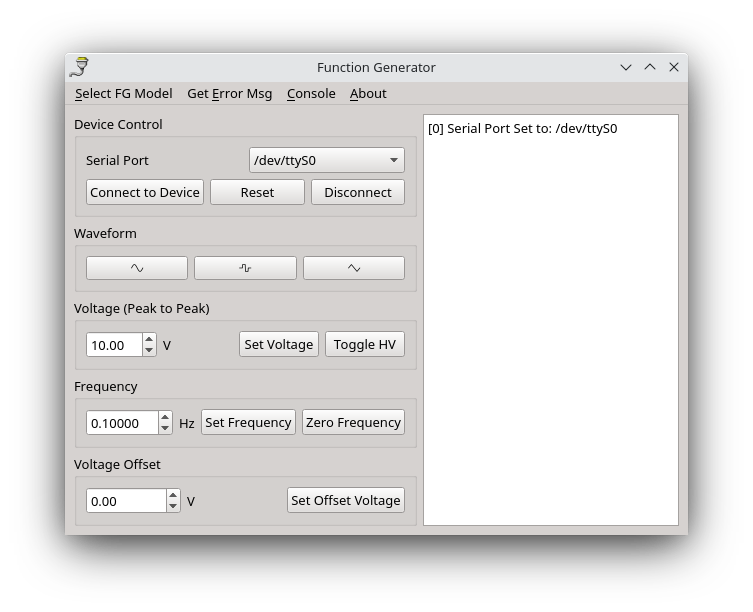

# HP Function Generator Driver

This is a simple bit of code to talk to either the HP 3325B or HP 33120A. It works on both linux and windows

## Why?

Because I have both of these. The interface on the 33120A is a pain in the ass and the 3325B is hard to reach.

## Connections

### HP 3325B

This code is designed to work with the RS-232 connection with the HP 3325B. I borrowed from https://github.com/heeres/qtlab which talks over the HP-IB protocol. On the back on the 3325B is a DB25 serial port. You'll need an adapter to go either to USB or to DB-9. [Like this one](https://www.amazon.com/Serial-Prolific-Connect-Supports-Windows/dp/B017D0FDVK/). However note that this one is "straight through", you'll need a null modem adapter to actually be able to talk to the function generator. If you have something like that D-tech adapter, you'll also need a [male to female null modem adapter](https://www.amazon.com/female-slimline-transfer-serial-adapter/dp/B075XHWVSJ/).

I'm using the default parameters, 300 Baud rate, 7 bits and even parity.
You can change those defaults in `HP3325B.py` at the top.

You can then test that the thing works in the command line by importing `HP3325B`

and then

```
    dev = HP3325B(com_port = '/dev/ttyUSB0')
    dev.setup_connection()
    dev.connect()
```

The "Remote" light should turn on on the function Generator

### HP33120A
As per the manual, this has a DB-9 rs232 port on the back, but this also requires either a null modem adapter, or null modem cable. I'm running this one straight into a serial port on the back on the computer.

## Setup
This is a simple series of python scripts (with GUI) that work best with anaconda/miniconda.

### Required Packages

```
serial (pyserial)
numpy
PyQt5
```

You can then simply run:

```
python function_generator_ui.py
```

from the command line to open the UI.


## Operation
1. Select Function Generator Model from drop down
2. select correct serial port.
3. connect to device
4. send whatever commands you want. If you send a bad command, click `Get Error Msg` to clear the error message.
5. Disconnect when done! 


